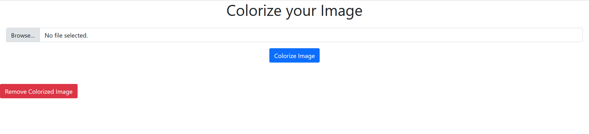

# Image Colorization App
This repository contains the files and folders needed to deploy a colorization app locally or in the cloud.
This app takes as an input an uncolorized color (black and white) and colorizes it using a Machine Learning model. 
The ML model used here is built based on the model defined on image colorization repository. For more information about it please check this link: https://github.com/OussamaHadad/Image_Colorization

# How to deploy the model?
## Method 1:  Local deployment
1° Clone the repository  
2° Install the python version mentionned in Dockerfile  
3° Install the python libraries mentionned in requirements.txt  
4° Run app.py  
5° Go to: localhost:5000/

## Method 2: Local deployment with Docker
1° Clone the repository  
2° cd to the colorize_app folder  
3° Go to terminal and type the following commands:  
  >3.1° docker image build -t "some-name-from-your-choice" .  
  >3.2° docker run -p 5000:5000 -d "the-name-you-chose"  
  >3.3° wait for few seconds  
4° Go to: localhost:5000/

Finally, the following web page arises and then you can colorize your old images.  
Give it a try!

  

